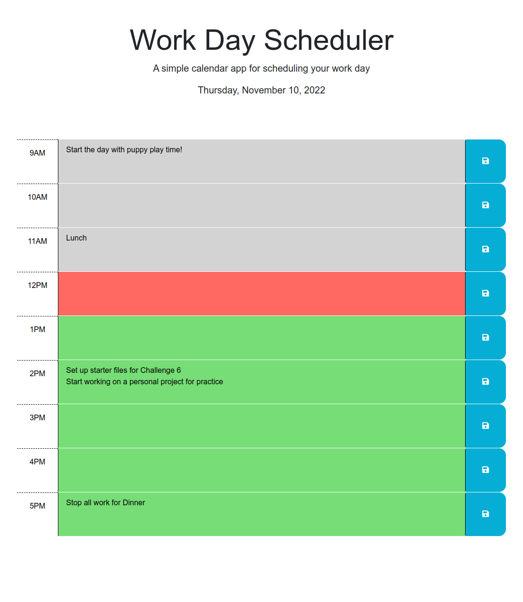

# work-day-scheduler

## Description

To help users time box their daily tasks for the work day, this scheduler will allow them to add events to hour slots and save them locally. When they reload the page, it will retrieve any saved data and color code the times depending on if the hour slot is from the past, present, or for the future. The jQeury and Day.js API's were used for this project. Starter files with the Bootstrap framework were provided.

## Installation

N/A

## Usage

Add events to the schedular by typing inside the grey, red, or green time slots. Clicking the save button on the left will save the events to the users local storage. Reloading the page will retrieve any events from the local storage.

Deployed page link: https://josht-dev.github.io/wk5c-work-day-scheduler/

## Credits

N/A

## License

Refer to the LICENSE in the repo. 